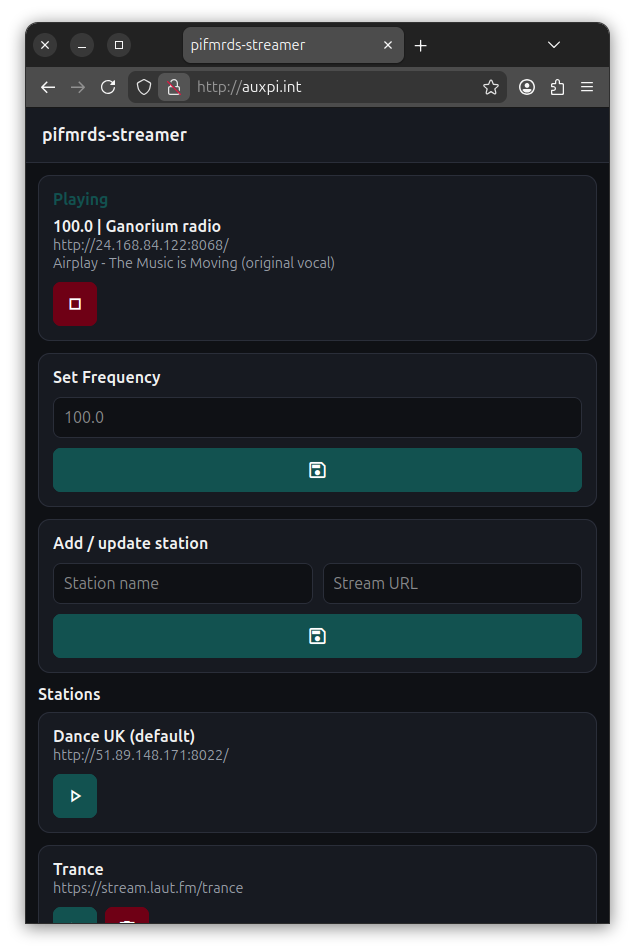

# pifmrds-streamer

`pifmrds-streamer` is a small web-controlled internet radio streamer for Raspberry Pi that rebroadcasts an online audio stream over FM using **PiFmRds**.

It provides a local web interface to manage radio stations, automatically starts playing on boot, and updates RDS text with station and track information where available.



## Requirements

A Raspberry Pi capable of running PiFmRds, with an FM antenna connected as described in the PiFmRds documentation.

Raspberry Pi OS (older releases are fine), Python 3, and root access.

## System setup

Install required system packages:

```bash
sudo apt update
sudo apt install -y ffmpeg python3 python3-venv
```

Install PiFmRds separately by following the official instructions:

[https://github.com/ChristopheJacquet/PiFmRds](https://github.com/ChristopheJacquet/PiFmRds)

Ensure the `pifmrds` binary is available in your PATH.

## Python environment

This project uses **uv** for Python dependency management.

Install uv:

[https://github.com/astral-sh/uv](https://github.com/astral-sh/uv)

From the project directory:

```bash
uv venv
source .venv/bin/activate
uv pip install -r pyproject.toml
```

## Configuration

State is stored as JSON at:

```text
/root/.config/pifmrds-streamer/stations.json
```

This file contains the station list and the last selected station. It can be edited manually when the service is stopped.

A default station named **“Dance UK”** is always present.

## Running manually

Run as root:

```bash
sudo .venv/bin/python app.py
```

The web interface will be available at:

```text
http://<pi-ip>
```

On startup, the streamer resumes the last selected station or falls back to the default.

## Running at boot

Create a systemd service:

```bash
sudo vi /etc/systemd/system/pifmrds-streamer.service
```

```ini
[Unit]
Description=pifmrds-streamer
After=network-online.target
Wants=network-online.target

[Service]
Type=simple
User=root
WorkingDirectory=/opt/pifmrds-streamer
ExecStart=/opt/pifmrds-streamer/.venv/bin/python app.py
Restart=always
RestartSec=5

[Install]
WantedBy=multi-user.target
```

Enable and start the service:

```bash
sudo systemctl daemon-reload
sudo systemctl enable pifmrds-streamer
sudo systemctl start pifmrds-streamer
```

Tail logs:

```bash
sudo journalctl -fu pifmrds-streamer
```
